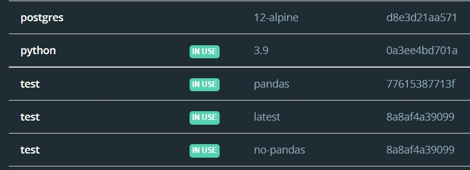
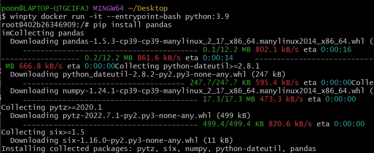
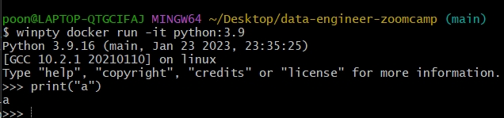
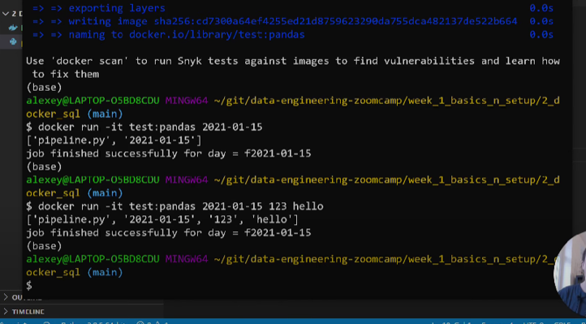

# Basic Docker
### "Isolate"
เมื่อเราทำอะไรก็ตามใน container พอออกจาก container ก็จะกลับมาเป็นเหมือนเดิม ต่อให้ลบทุกอย่างออก พอ run container ขึ้นมาใหม่ ทุกอย่างก็จะยังอยู่ตามเดิม

### Build -> Run
เราจะ build container ขึ้นมา โดยมันจะไปอ่าน config จาก Dockerfile จากนั้นเราก็จะเอา container นั้นมารัน แล้วทำอะไรต่อบน container นั้นๆได้

### Basic Command
~~~ 
docker build -t {name}:{tag}
~~~ 
- window อย่าลืมเปิด docker desktop ก่อนรัน
- ถ้าใน local เราไม่มี container ไหน เวลา run มันจะ automatically pull image ลงมาเองเลย (pull image -> build container -> run container) 
- เราสามารถดูได้ว่ามี container อะไรบ้างใน docker desktop/ command ก็ได้
- tag (optional) คล้ายๆเวอชั่น ex. python:3.9 test:pandas ถ้าไม่ใส่ tag ก็จะเป็น lastest 

- ถ้า tag เดียวกัน แล้ว build ใหม่ ก็จะเหมือนเรา save ทับ tag เดิม 

~~~ 
docker run -it {name}:{tag}
~~~
--it is short for --interactive เมื่อเรา run พร้อมกับ -it มันจะพาเราเข้าไปอยู่ใน container นี้ และสามารถรันอะไรต่อให้มัน interactive กับเราได้

### Example
~~~
docker run -it --entrypoint=bash python:3.9
~~~

- พอ run แล้วก็จะเข้าไปอยู่ใน root ของ container นั้นๆ จะออกจาก container ก็ต้อง exit (exit / ctrl+d etc.)
- เมื่อเราให้ entry_point=bash เวลารัน container เราก็จะสามารถรันคำสั่ง pip ต่อได้ กลับกัน ถ้าให้ entrypoint=python ก็จะรัน python ได้ แต่ pip ไม่ได้

- ตย.นี้เรา run python:3:9 โดยไม่ได้ระบุให้ entry_point=bash เราก็จะสามารถรัน python ต่อได้ เพราะ python:3:9 entrypoint มันเป็น python อยู่แล้ว

### Docker file
~~~
FROM python:3.9.1

RUN pip install pandas

ENTRYPOINT [ "python"]
~~~

- ตย.นี้คือ เตรียม pandas ไว้ให้แล้ว พอรัน container นี้ เราก็จะสามารถ import pandas ได้เลย ไม่ต้อง pip และสามารถรัน python ได้เลย
- entrypoint=python แต่ทำไมถึง RUN pip ได้?? เพราะ RUN pip install pandas จะเกิดขึ้นก่อน entrypoint (ตามในไฟล์เลย) คนละเคสกับเรารัน container แล้วค่อยรันคำสั่งอะไรต่อภายใน root ของ container นั้นๆ

~~~
FROM python:3.9.1

RUN pip install pandas

WORKDIR /app
COPY pipeline.py pipeline.py

ENTRYPOINT [ "python", "pipeline.py" ]
~~~
- อันนี้คือ install pandas ให้ แล้วก็สร้าง dir app แล้ว copy file pipeline.py ไปยัง pipeline.py เส็ดแล้วจะไปรัน pipeline.py แล้วก็รัน python ได้

pipeline.py;
~~~
import pandas as pd
import sys #get arg from system

print(sys.argv)

day = sys.argv[1]

# do some job

print(f'job finished for day: f{day}')
~~~
- เราสามารถรับ argument จาก system ได้ 

- พอเรา run container แล้วใส่ arg มา pipeline.py ก็จะรับ arg มา print 
- ถ้าเราใส่หลายๆ arg มันก็รับมาหมดได้เหมือนกัน เป็น sys.argv[2] , sys.argv[3], ...

