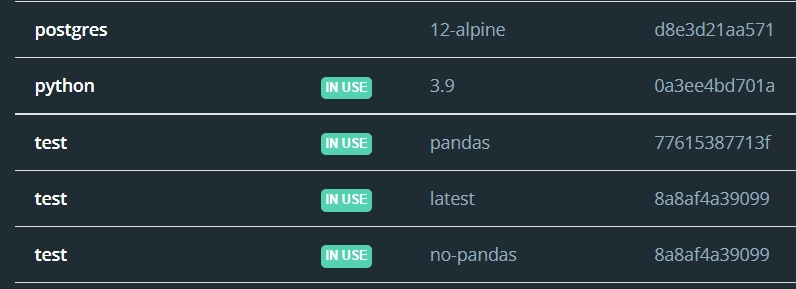
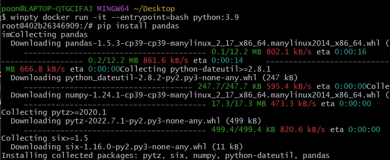
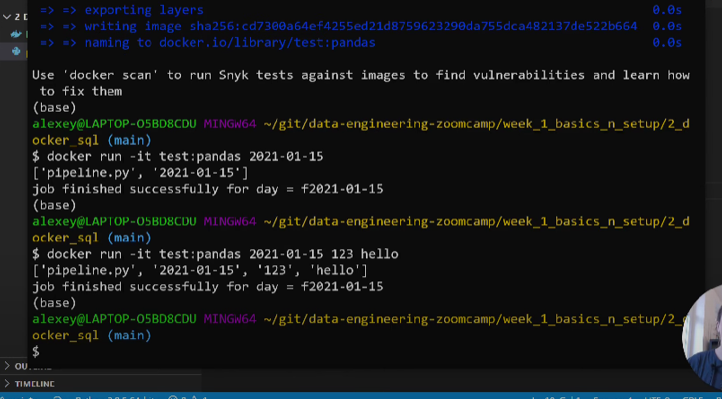

# Docker

# Table of content

0. [Intro to Docker](#intro-to-docker)

1. [basic comand](#basic-command)

2. [run postgres](#run-postgres)

3. [pipeline](#pipeline)

# Intro to Docker
### "Isolate"
เมื่อเราทำอะไรก็ตามใน container พอออกจาก container ก็จะกลับมาเป็นเหมือนเดิม ต่อให้ลบมทุกอย่างออก พอ run container ใหม่ก็จะกลับมามีครบเหมือนเดิม

### Build -> Run
หลักการคือ เราจะ build container ขึ้นมา (build ครั้งเดียว) โดยมันจะไปอ่าน config จาก Dockerfile จากนั้นเราก็จะเอา container นั้นมารัน แล้วทำอะไรต่อบน container นั้นๆได้

# Basic Command
~~~ 
docker build -t {name}:{tag}
~~~ 
- ถ้าใน local เราไม่มี container ไหน เวลา run มันจะ automatically pull image ลงมาเองเลย (pull image -> build container -> run container) 
- เราสามารถดูได้ว่ามี container อะไรบ้างใน docker desktop/ command ก็ได้
- tag (optional) คล้ายๆเวอชั่น ex. python:3.9 test:pandas ถ้าไม่ใส่ tag ก็จะเป็น lastest 

- ถ้า tag เดียวกัน แล้ว build ใหม่ ก็จะเหมือนเรา save ทับ tag เดิม 

~~~ 
docker run -it {name}:{tag}
~~~

### Example
~~~
docker run -it --entrypoint=bash python:3.9
~~~

- พอ run แล้วก็จะเข้าไปอยู่ใน root ของ container นั้นๆ จะออกจาก container ก็ต้อง exit (exit / ctrl+d etc.)
- เมื่อเราให้ entry_point=bash เวลาเรารัน container นี้ เราก็จะสามารถรันคำสั่ง pip ต่อได้ กลับกัน ถ้าให้ entrypoint=python ก็จะรัน python ได้ แต่ pip ไม่ได้

### Docker file
~~~
FROM python:3.9.1

RUN pip install pandas

ENTRYPOINT [ "python"]
~~~

- ตย.นี้คือ เตรียม pandas ไว้ให้แล้ว พอรัน container นี้ เราก็จะสามารถ import pandas ได้เลย ไม่ต้อง pip หรือเราจะรัน python อะไรก็ได้
- entrypoint=python แต่ทำไมถึง RUN pip ได้?? เพราะ RUN pip install pandas จะเกิดขึ้นก่อน entrypoint (ตามในไฟล์เลย) คนละเคสกับเรารัน container แล้วค่อยรันคำสั่งอะไรต่อภายใน root ของ container นั้นๆ


~~~
FROM python:3.9.1

RUN pip install pandas

WORKDIR /app
COPY pipeline.py pipeline.py

ENTRYPOINT [ "python", "pipeline.py" ]
~~~
- อันนี้คือ install pandas ให้ แล้วก็สร้าง dir app แล้ว copy file pipeline.py ไปยัง pipeline.py เส็ดแล้วจะไปรัน pipeline.py และเปิด python มาให้เรารันต่อได้


pipeline.py;
~~~
import pandas as pd
import sys #get arg from system

print(sys.argv)

day = sys.argv[1]

# do some job

print(f'job finished for day: f{day}')
~~~
- เราสามารถรับ argument จาก system ได้ 



- พอเรา run container แล้วใส่ arg มา pipeline.py ก็จะรับ arg มา print 
- ถ้าเราใส่หลายๆ arg มันก็รับมาหมดได้เหมือนกัน เป็น sys.argv[2] , sys.argv[3], ...


# Run postgres 

create docker network

```bash
docker network create pg-network
```


run postgres db

~~~bash
docker run -it \
  -e POSTGRES_USER="root" \
  -e POSTGRES_PASSWORD="root" \
  -e POSTGRES_DB="ny_taxi" \
  -v $(pwd)/ny_taxi_postgres_data:/var/lib/postgresql/data \
  -p 5432:5432 \
  --network=pg-network \
  --name=pg-database \
  postgres:13
~~~

connect to postgres by pgAdmin
~~~bash
docker run -it \
  -e PGADMIN_DEFAULT_EMAIL="admin@admin.com" \
  -e PGADMIN_DEFAULT_PASSWORD="root" \
  -p 8080:80 \
  --network=pg-network \
  dpage/pgadmin4
~~~

# Pipeline

download data by wget
~~~python
os.system(f"wget {url} -O {parquet_name}")
~~~

read parquet file into smaller chunk (10000 records per each chunk)
The batches variable data type will be generator 

~~~python
_file = pq.ParquetFile(parquet_name)

batches = _file.iter_batches(batch_size = 10000) 
~~~ 

connect to db
~~~python
engine = create_engine(f'postgresql://{user}:{password}@{host}:{port}/{db}')
~~~

clean data and insert each chunk of data to db
~~~python
for data_chunk in batches:
    t_start = time()

    df_chunk = data_chunk.to_pandas()
    df_chunk['tpep_pickup_datetime'] = pd.to_datetime(df_chunk.tpep_pickup_datetime)
    df_chunk['tpep_dropoff_datetime'] = pd.to_datetime(df_chunk.tpep_dropoff_datetime)

    t_end = time()
    df_chunk.to_sql(name=table_name, con=engine, if_exists='append')

    print('inserted another chunk..., tool %.3f second' % (t_end - t_start))
~~~
